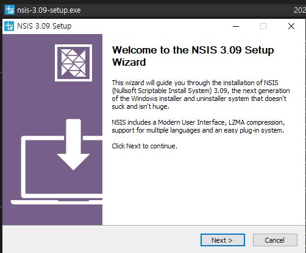

## 1. NSIS 설치

 

- NSIS 다운로드 페이지로 [이동](https://nsis.sourceforge.io/Download) 및 다운로드 [(링크)](https://prdownloads.sourceforge.net/nsis/nsis-3.09-setup.exe?download)
    
- 다운받은 NSIS 패키지 인스톨
    

 

## 2. HM NIS Edit 설치

 

- HM NIS Edit 다운로드 페이지로 [이동](https://hmne.sourceforge.net/)
- 페이지 하단 다운로드의 `nisedit2.0.3.exe` 다운로드 [(링크)](http://prdownloads.sourceforge.net/hmne/nisedit2.0.3.exe?download)
    
- 다운받은 NIS Edit 패키지 인스톨
    
    - 설치 도중 아래 이미지와 같은 오류가 나오는데, 스페인어 스크립트이다. 무시 눌러 계속 진행
        

 

## 3. 참조 자료

 

- [nsis.sourceforge.io](https://nsis.sourceforge.io)
- [HM NIS EDIT: A Free NSIS Editor/IDE](https://hmne.sourceforge.net/)