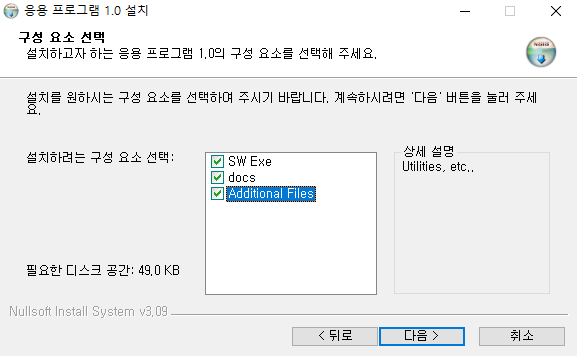
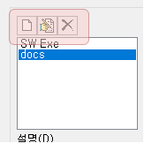
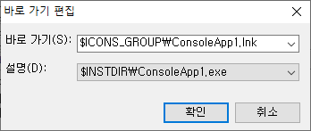
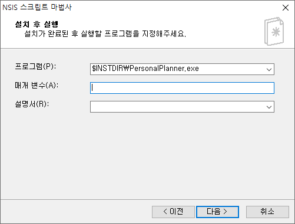
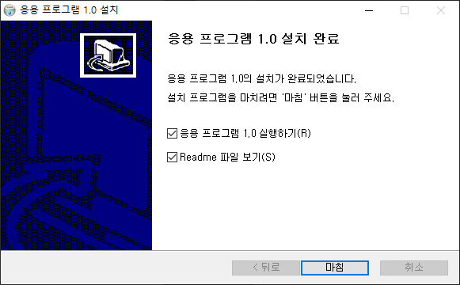
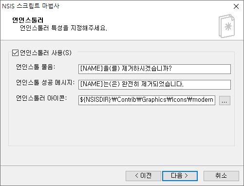
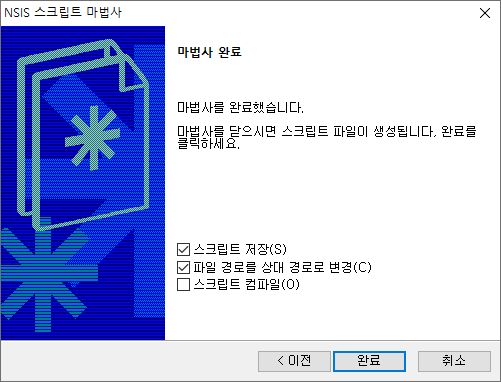
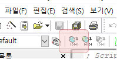

## 1. NIS Edit 실행

 

- `NIS Edit`을 실행한다.
    
- 바탕화면에 바로가기 생성을 하지 않은 경우, 기본 설치 경로는 아래와 같다.
    - C:\Program Files (x86)\HMSoft\NIS Edit\nisedit.exe

 

## 2. 스크립트 작성 마법사

 

- 화면 좌측 상단, 요술봉 모양의 `스크립트 작성 마법사` (단축키 Ctrl + W)를 실행한다.
    

 

### 2.1. SW 패키지 정보 입력

 

- SW 패키지의 기본 정보를 입력한다.
    

 

### 2.2. SW 설치 옵션 입력

 

- SW 설치 옵션을 입력한다.
    
    - `설치 아이콘`의 경우 원하는 아이콘을 선택해주면 된다.
        - NSIS 설치 시 제공되는 기본 아이콘을 사용해도 무방하다. 경로 : C:\Program Files (x86)\NSIS\Contrib\Graphics\Icons
    - `설치 파일`은 출력될 설치파일의 경로이다.
    - `설치 언어`는 설치파일을 실행할 때 사용자가 선택 가능한 언어 옵션이다.
    - `GUI` 및 `압축`은 기본값 (`Modern` & `zlib`) 으로 유지한다.

 

### 2.3. 기본 설치 경로 및 라이선스 파일 입력

 

- 기본 경로 및 라이선스 파일을 넣어준다.
    
    - 적용할 라이선스가 없다면, `라이센스 파일` 아래 텍스트 박스를 공란으로 한다.
        

 

### 2.4. SW 파일 등록

 

- 프로그램 파일 메뉴에 있는 기본 예시 파일 2개를 제거한다.
    
- 파일 제거 후 `그룹 이름` 및 `설명`을 수정한다.
- `파일 추가` 또는 `AddDirTree` 버튼을 눌러 패키지에 포함할 파일을 추가한다.
    
    

 

#### 2.4.1. 설치 항목 분리

 

- SW 파일 등록 시 그룹을 나누어 아래 이미지와 같이 설치 항목을 나눌 수 있다.
    

 

- `스크립트 마법사`에서 각 `그룹`이 구성 요소가 되고, `설명`에 적은 항목이 상세 설명에 들어간다.
    
    - 설명 하단부 `사용자가 설치할 컴포넌트를 ~ ` 체크박스를 체크해준다.
- 왼쪽 그룹 요소 상단부의 새 그룹, 편집, 제거 버튼을 이용해 그룹을 구성하고, 각각의 파일을 추가한다.
    

 

### 2.5. 바로 가기 생성 옵션

 

- 바로 가기 생성 옵션을 선택한다.
    
    - `프로그램 시작 메뉴` 옵션은 `시작 메뉴\프로그램` 폴더에 생성할 폴더명이다.
    - `바로 가기` 항목은 원하는만큼 추가 / 제거가 가능하다.
    - `바로 가기 추가`를 누르면 아래와 같은 화면이 나온다.
        
        - `바로 가기` : 생성된 lnk 파일이 위치할 장소이다.
            - `$ICONS_GROUP` : `프로그램 시작 메뉴`에서 설정한 폴더
            - `$DESKTOP` : 바탕 화면
            - `$STARTMENU` : 시작 메뉴
            - `$SMPROGRAMS` : 시작 메뉴\프로그램
        - `설명` : lnk 파일의 원본을 선택한다.

 

### 2.6. 설치 후 실행 옵션

 

- 설치 완료 후 실행할 파일 설정이다.
    
    - 프로그램 : 실행할 `.exe` 파일. 등록 시 인스톨 완료 후 아래 이미지와 같이 프로그램 실행 옵션이 생성된다.
    - 매개 변수 : `.exe` 실행 시 필요한 매개 변수가 있다면 입력한다.
    - 설명서 : 등록할 README 파일이 있다면 입력한다. 등록 시 인스톨 완료 후 아래와 같이 README 보기 옵션이 생성된다.
        

 

### 2.7. 언인스톨러 옵션

 

- 언인스톨러를 사용할 경우 옵션을 설정한다. 주로 사용 여부 및 아이콘만 설정하게 된다.
    

 

### 2.8. 스크립트 저장 및 컴파일

 

- 앞서 설정한 항목의 값을 바탕으로 `NSIS 스크립트`가 자동 생성된다.
- 스크립트 저장 옵션을 설정한 후 마법사를 종료한다.
    
- 화면 좌측 상단의 컴파일 버튼을 눌러 컴파일을 수행하면 [2.2. SW 설치 옵션 입력](#22-sw-설치-옵션-입력)에서 지정한 위치에 설치 파일이 출력된다.
    