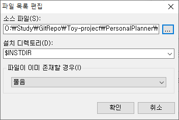

## 1. NIS Edit 실행

 

- `NIS Edit`을 실행한다.
    
- 바탕화면에 바로가기 생성을 하지 않은 경우, 기본 설치 경로는 아래와 같다.
    - C:\Program Files (x86)\HMSoft\NIS Edit\nisedit.exe

 

## 2. 스크립트 작성 마법사

 

- 화면 좌측 상단, 요술봉 모양의 `스크립트 작성 마법사` (단축키 Ctrl + W)를 실행한다.
    

 

### 2.1. SW 패키지 정보 입력

 

- SW 패키지의 기본 정보를 입력한다.
    

 

### 2.2. SW 설치 옵션 입력

 

- SW 설치 옵션을 입력한다.
    
    - `설치 아이콘`의 경우 원하는 아이콘을 선택해주면 된다.
        - NSIS 설치 시 제공되는 기본 아이콘을 사용해도 무방하다. 경로 : C:\Program Files (x86)\NSIS\Contrib\Graphics\Icons
    - `설치 파일`은 출력될 설치파일의 경로이다.
    - `설치 언어`는 설치파일을 실행할 때 사용자가 선택 가능한 언어 옵션이다.
    - `GUI` 및 `압축`은 기본값 (`Modern` & `zlib`) 으로 유지한다.

 

### 2.3. 기본 설치 경로 및 라이선스 파일 입력

 

- 기본 경로 및 라이선스 파일을 넣어준다.
    
    - 적용할 라이선스가 없다면, `라이센스 파일` 아래 텍스트 박스를 공란으로 한다.
        

 

### 2.4. SW 파일 등록

 

- 프로그램 파일 메뉴에 있는 기본 예시 파일 2개를 제거한다.
    
- 파일 제거 후 `그룹 이름` 및 `설명`을 수정한다.
- `파일 추가` 또는 `AddDirTree` 버튼을 눌러 패키지에 포함할 파일을 추가한다.
    
    

 

### 2.5. 아이콘 생성 옵션

 

- 아이콘 생성 옵션을 선택한다.
    
    - `프로그램 시작 메뉴` 옵션은 시작 메뉴에 생성할 폴더명이다.
    - `바로 가기` 경로 설정의 `$ICONS_GROUP`은 시작 메뉴를 의미한다.