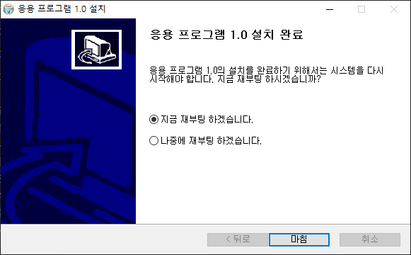

## Introduction

<br>

- 본문의 내용은 SW 설치 후 재부팅 선택 옵션을 만드는 방법이다.
    

<br>

## 절차

<br>

- 스크립트의 `Function .onInit`에 아래 플래그를 넣어준다.
    ```text
    SetRebootFlag true
    ```
- 만약 `Function .onInit`이 없다면, `인스톨 섹션`의 위에 아래 스크립트를 넣어준다.
    ```text
    Function .onInit
         SetRebootFlag true
    FunctionEnd
    ```

<br>

## 참조 자료

<br>

- [2. Create default installer](2.%20Create%20default%20installer.md)