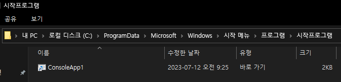

## Introduction

<br>

- 본문의 내용은 SW 설치 시 `시작프로그램`에 바로가기를 등록하는 방법이다.
    

<br>

## 방법

<br>

- 스크립트의 `Exe 설치 섹션`에 스크립트를 넣어준다.
    ```text
    CreateShortCut "C:\ProgramData\Microsoft\Windows\Start Menu\Programs\StartUp\ConsoleApp1.lnk" "$INSTDIR\ConsoleApp1.exe"
    ```
    - 윈도우 설치 경로 및 exe 파일 이름을 고려하여 넣어주면 된다.

<br>

- NSIS 상수 `$SMSTARTUP`을 이용하여 추가할 수도 있으나 추천하지는 않는다.
    ```text
    CreateShortCut "$SMSTARTUP\ConsoleApp1.lnk" "$INSTDIR\ConsoleApp1.exe"
    ```
    - 이 방법은 **문제점**이 있다. 설치파일이 윈도우 디펜더에 `트로이목마`로 인식되는 경우가 있다.
    - 따라서, 가능하면 상기 방법으로 추가한다.

<br>

- 언인스톨러를 사용하는 경우, 스크립트 하단의 `Section Uninstall`에 삭제 스크립트를 넣어준다.
    ```text
    Delete "C:\ProgramData\Microsoft\Windows\Start Menu\Programs\StartUp\ConsoleApp1.lnk"
    ```

<br>

## 참조 자료

<br>

- [2. Create default installer](2.%20Create%20default%20installer.md)