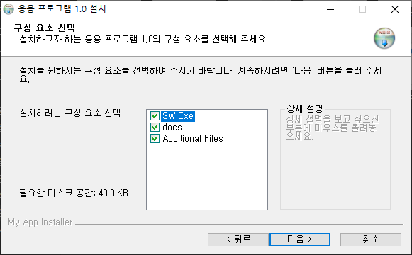

## Introduction

<br>

- 본문의 내용은 SW 설치 시 화면 하단의 `Nullsoft ~`레이블을 수정하는 방법이다.
    

<br>

## 절차

<br>

- 스크립트의 `; MUI Settings` 지역에 아래 스크립트를 넣어준다.
    ```text
    BrandingText "My App Installer"
    ```
    

<br>

## 참조 자료

<br>

- [2. Create default installer](2.%20Create%20default%20installer.md)