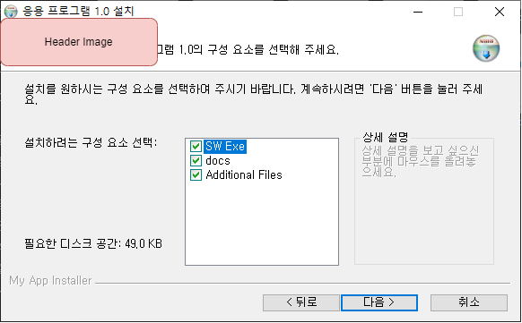
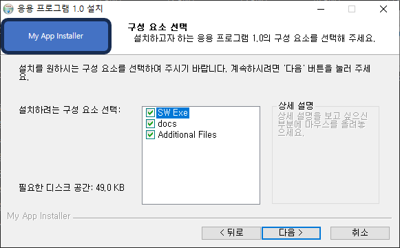

## Introduction

<br>

- 본문의 내용은 SW 설치 시 헤더 이미지를 추가하는 방법이다.
    

<br>

## 절차

<br>

- 삽입할 이미지를 준비한다. 사이즈는 최대 `175 * 53` 이다.
    

- 스크립트의 `; MUI Settings` 지역에 아래 스크립트를 넣어준다.
    ```text
    ; Header image 사용 선언

    !define MUI_HEADERIMAGE

    ; 인스톨 이미지 설정

    !define MUI_HEADERIMAGE_BITMAP "C:\Study\NSIS\Images\header.bmp"   ; 이미지 경로 입력.
    !define MUI_HEADERIMAGE_BITMAP_NOSTRETCH    ; 이미지 사이즈 그대로 출력 : 왜곡 없는 대신 최대 사이즈 넘어가거나 작은 경우 이상하게 보일 수 있음

    ; 언인스톨 이미지 설정

    !define MUI_HEADERIMAGE_UNBITMAP "C:\Study\NSIS\Images\header.bmp"
    !define MUI_HEADERIMAGE_UNBITMAP_NOSTRETCH
    ```
    

<br>

## 참조 자료

<br>

- [2. Create default installer](2.%20Create%20default%20installer.md)