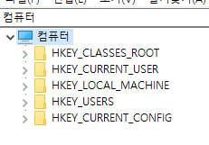

## Introduction

<br>


- NSIS는 레지스트리 읽기, 쓰기, 제거가 가능하다.
- 읽기, 쓰기 명령의 경우 대체로 명령어의 사용 방법이 같다.
- 본문의 내용은 SW 인스톨 또는 언인스톨 상황에서 레지스트리를 조작하는 방법이다.

<br>

## Example

<br>

- 아래 내용에 나오는 `RootKey` 항목은 다음과 같다.
    - HKCR : HKEY_CLASSES_ROOT
    - HKCU : HKEY_CURRENT_USER
    - HKLM : HKEY_LOCAL_MACHINE
    - HKU : HKEY_USERS
    - HKCC : HKEY_CURRENT_CONFIG

<br>

### Read registry

<br>

```text
; 레지스트리 읽기 명령

Command var RootKey "SubKey" "Name"
```

```text
; 레지스트리 읽기 예시

ReadRegDWORD $R0 HKLM "SOFTWARE\Microsoft\Windows\CurrentVersion\Policies\System" "EnableLUA"
```

- 아래는 사용 가능한 `Command` 목록이다.
    - ReadRegDWORD : 32bit DWORD
    - ReadRegStr : string

<br>

### Write registry

<br>

#### Write registry without value

<br>

```text
; 레지스트리 쓰기 명령

Command RootKey "SubKey" "KeyName"
```

```text
; 레지스트리 쓰기 예시

WriteRegNone HKCU "MySubKey" "Reserved"
```

- 값 없이 키만 넣는 경우 `Command`는 `WriteRegNone`을 써주면 된다.

<br>

#### Write registry with value

<br>

```text
; 레지스트리 쓰기 명령

Command RootKey "SubKey" "KeyName" "Value"
```

```text
; 레지스트리 쓰기 예시

WriteRegDWORD HKLM "SOFTWARE\Microsoft\Windows\CurrentVersion\Policies\System" "EnableLUA" "00000000"
```

- 아래는 사용 가능한 `Command` 목록이다.
    - WriteRegDWORD : 32bit DWORD
    - WriteRegBin : binary
    - WriteRegStr : string
    - WriteRegExpandStr : REG_EXPAND_SZ

<br>

### Remove registry

<br>

```text
; 레지스트리 키 제거 명령

Command RootKey "SubKey"
```

```text
; 레지스트리 키 제거 예시

DeleteRegKey HKCU "MySubKey"
```

- `SubKey` 안에 있는 모든 키를 제거한다.

<br>

```text
; 레지스트리 값 제거 명령

Command RootKey "SubKey" "KeyName"
```

```text
; 레지스트리 값 제거 예시

DeleteRegValue HKCU "MySubKey" "Reserved"
```

- `KeyName`의 값을 제거한다.

<br>

## 참조 자료

<br>

- [4.9.2 Registry, INI, File Instructions](https://nsis.sourceforge.io/Docs/Chapter4.html#registry)
- [2. Create default installer](2.%20Create%20default%20installer.md)